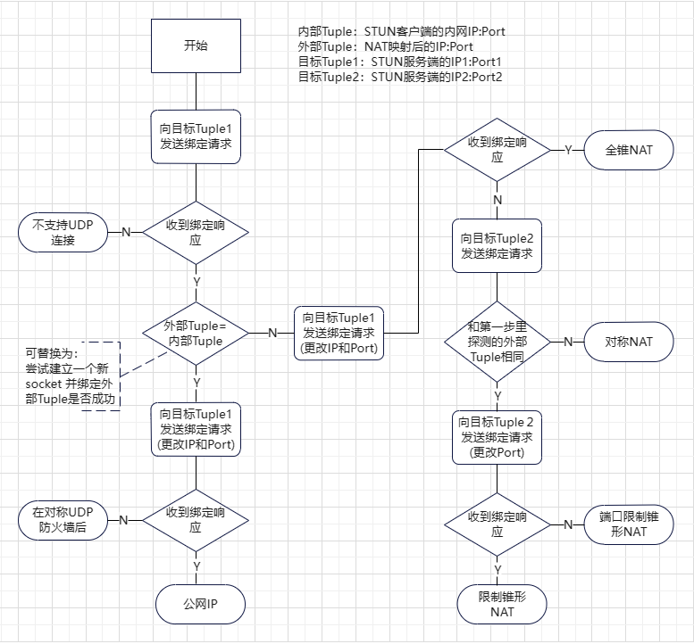

遵循RFC3489的STUN客户端和服务端实现，支持IPv6，服务端支持位于可控NAT后的服务器(可将指定端口映射到公网)。

依赖库：pycryptodome


# Client:

## stuntools.get_nat_info()
STUN客户端实现，得到主机NAT信息。

语法：`get_nat_info(stun_addr, local_addr=None, ip_version=4, timeout=2，port_mode_check = False):`

参数释义：
- stun_addr：stun服务器的地址和端口，Tuple类型。
- local_addr：本地地址，Tuple类型，禁止传入`('', 80)`这样的空地址，表示所有地址应使用`('0.0.0.0', 80)`或者`('::', 80)`
- ip_version：整数 4 或者 6  对应IPv4和IPv6
- timeout：NAT探测的超时时间
- port_mode_check: 是否检查NAT端口分配模式

返回值：
`{'type':'', 'external':(), 'info':'', 'port_mode':''}`
type：NAT类型，Str类型
external：外部地址，Tuple类型
info：当类型为Error或Blocked时才具有此值，Str类型。
port_mode：端口分配模式 
            - Increment(递增模式)
            - Decrement(递减模式)
            - Random(随机模式)
            - `port_mode_check = False` 或探测失败时为空字符串

检测流程：


## 示例：
```python 
from stuntools import get_nat_info

stun_addr = ('stun.htype.top', 3478)
nat_info = get_nat_info(stun_addr=stun_addr , local_addr=None, ip_version=4, timeout=2, port_mode_check=True)
if nat_info['type'] != 'Error':
    print('NAT Type:', nat_info['type'])
    print('External address:', nat_info['external'])
    print('Port allocation mode: ', nat_info['port_mode'])
else:
    print('Error info:', nat_info['info'])
```
如需检测IPv6NAT类型，吧`nat_info = get_nat_info(stun_addr=stun_addr , local_addr=None, ip_version=4, timeout=2)`的ip_version参数改为6即可。


# Server：

## class stuntools.StunServer
STUN服务端实现，为其他客户端提供STUN服务。
要求服务器拥有两个公网IP，或者使用两台有公网IP的服务器。
支持服务器位于NAT后的情况，但必须为NAT可控的情况(可将指定端口映射到公网)。

实例化语法：
```python
StunServer(node_key,
           ipv4_a_public,
           ipv4_b_public,
           ipv4_a_load='',
           ipv4_b_load='',
           ipv6_a_public='',
           ipv6_b_public='',
           ipv6_a_load='',
           ipv6_b_load='',
           port_group=(3478, 3479) )
```

参数释义：
- node_key:：16字节bytes类型数据, 用做会话/节点之间的验证密钥。
- ipv4_a_public：服务器的第一个公网IPv4地址(IP4_a)，Str类型
- ipv4_b_public：服务器的第二个公网IPv4地址(IP4_b)，Str类型
- ipv4_a_load：当服务器位于NAT后时公网IP4_a对应的私网地址，Str类型
- ipv4_b_load：当服务器位于NAT后时公网IP4_b对应的私网地址，Str类型
- ipv6_a_public：服务器的第一个公网IPv6地址(IP6_a)，Str类型
- ipv6_b_public：服务器的第er个公网IPv6地址(IP6_b)，Str类型
- ipv6_a_load：当服务器位于NAT后时公网IP6_a对应的私网地址，Str类型
- ipv6_b_load：当服务器位于NAT后时公网IP6_b对应的私网地址，Str类型
- port_group：stun服务开放的两个UDP端口，两个公网IP都要开放这两个端口， 默认(3478, 3479)，类型Tuple\[int, int\]


当主机直接拥有公网IP时只指定`*_public`参数即可   `*_load`参数留空
`ipv4_a_load`和`ipv4_b_load` 使用于服务器在SNAT后的情况, 用来指定需要绑定的私网IP

当服务器拥有两个公网IP地址时(IPv6同理):
    `ipv4_a_public`和`ipv4_b_public`指定为拥有的两个公网IP，如果在NAT后load参数必填，否则留空。
当使用两个服务器来实现时(IPv6同理):
    `ipv4_a_public`指定为本机公网IP，如果在NAT后`ipv4_a_load`参数必填，否则留空。
    `ipv4_b_public`指定为了一个服务器的公网IP，`ipv4_b_load`留空。
    或者两个服务器都使用`stuntools.Node`类来实现。

Tip:
    两个公网IP属性ipv4_a_public/ipv4_b_public为必选参数

### stuntools.StunServer.run()
开始运行STUN服务器，注意这会阻塞主线程。


## class stuntools.Node
stuntools.StunServer的子类，作为节点运行，用于服务器只有一个公网IP的情况。
实例化语法：
```python
Node(node_key, 
     ipv4_public, 
     node2_ipv4, 
     ipv6_public='',
     node2_ipv6='',
     ipv4_load='',
     ipv6_load='',
     port_group=(3478, 3479) )
```
参数释义：
- node_key:：16字节bytes类型数据, 用做会话/节点之间的验证密钥，两个节点需相同。
- ipv4_public：服务器的第公网IPv4地址，Str类型
- node2_ipv4：另一个节点的公网IPv4地址，Str类型
- ipv6_public：服务器的第公网IPv6地址，Str类型
- node2_ipv6：另一个节点的公网IPv6地址，Str类型
- ipv4_load：当服务器位于NAT后时公网IPv4对应的私网地址，Str类型
- ipv6_load：当服务器位于NAT后时公网IPv6对应的私网地址，Str类型
- port_group：stun服务开放的两个UDP端口，需和另一个节点相同，默认(3478, 3479)，类型Tuple\[int, int\]
Tip：
服务并不会主动探测另一个节点是否存在

### stuntools.Node.run()
开始运行STUN节点，注意这会阻塞主线程。


## 示例：

服务器同时拥有两个公网IPv4和IPv6的情况：
服务器网络情况：
- 两张网卡的IPv4都处于NAT后
    - 公网47.109.81.121 NAT转换为 私网192.168.10.12
    - 公网47.108.66.80 NAT转换为 私网192.168.11.13
- 两张网卡直接拥有两个IPv6地址(未经过NAT)
-  IPv4 NAT和IPv6 都对外映射了UDP3478和UDP3479端口
```python
from stuntools import StunServer

server = StunServer(node_key = b'ahjiuy68tfgcj987', 
                        ipv4_a_public='47.109.81.121', 
                        ipv4_b_public= '47.108.66.80', 
                        ipv4_a_load='192.168.10.12', 
                        ipv4_b_load='192.168.11.13', 
                        ipv6_a_public='2408:4006:1220:2ba6:d306:e:d6d1:ee70', 
                        ipv6_b_public='2408:4006:1220:2ba6:d306:e:d6d1:ee71', 
                        ipv6_a_load='', 
                        ipv6_b_load='',
                        port_group=(3478, 3479) )
server.run()
```


当使用两个服务器实现时：
服务器A网络情况：
- 拥有一个NAT后的公网地址
- 公网47.109.81.121 NAT转换为 私网192.168.10.12
- 直接拥有一个公网IPv6地址 2408:4006:1220:2ba6:d306:e:d6d1:ee70
- IPv4 NAT和IPv6 都对外映射了UDP3478和UDP3479端口
服务器B网络情况：
- 直接拥有一个公网IP地址 47.108.66.80
- 直接拥有一个公网IPv6地址 2408:4006:1220:2ba6:d306:e:d6d1:ee71
- IPv4和IPv6 都对外映射了UDP3478和UDP3479端口

服务器A代码：
```python
from stuntools import StunServer

server = StunServer(node_key = b'ahjiuy68tfgcj987', 
                        ipv4_a_public='47.109.81.121', 
                        ipv4_b_public= '47.108.66.80', 
                        ipv4_a_load='192.168.10.12', 
                        ipv4_b_load='', 
                        ipv6_a_public='2408:4006:1220:2ba6:d306:e:d6d1:ee70', 
                        ipv6_b_public='2408:4006:1220:2ba6:d306:e:d6d1:ee71', 
                        ipv6_a_load='', 
                        ipv6_b_load='',
                        port_group=(3478, 3479) )
server.run()
```
服务器B代码：
```python
from stuntools import Node

server = Node(node_key = b'ahjiuy68tfgcj987',
              ipv4_public = '47.108.66.80', 
              node2_ipv4 = '47.109.81.121', 
              ipv6_public = '2408:4006:1220:2ba6:d306:e:d6d1:ee71', 
              node2_ipv6 = '2408:4006:1220:2ba6:d306:e:d6d1:ee70', 
              ipv4_load = '', 
              ipv6_load = '', 
              port_group = (3478, 3479))
server.run()
```

